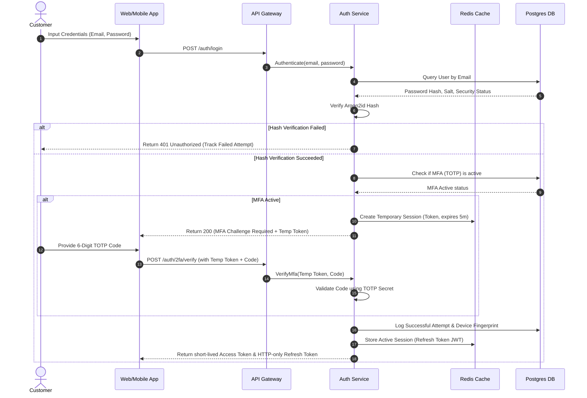
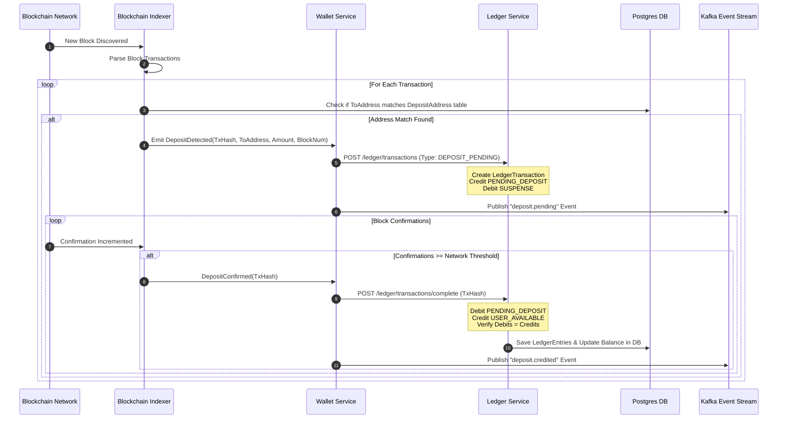
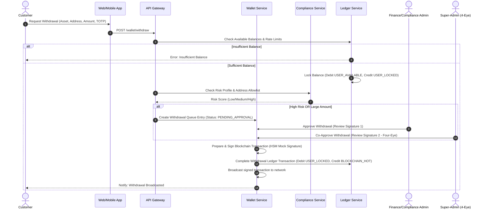
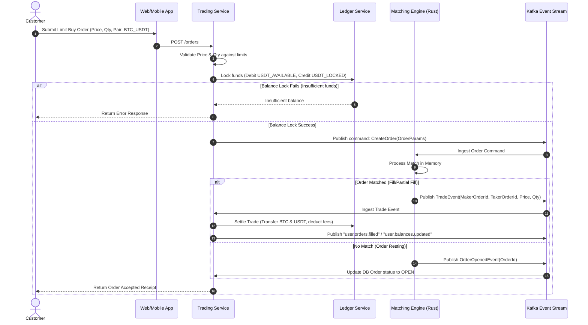
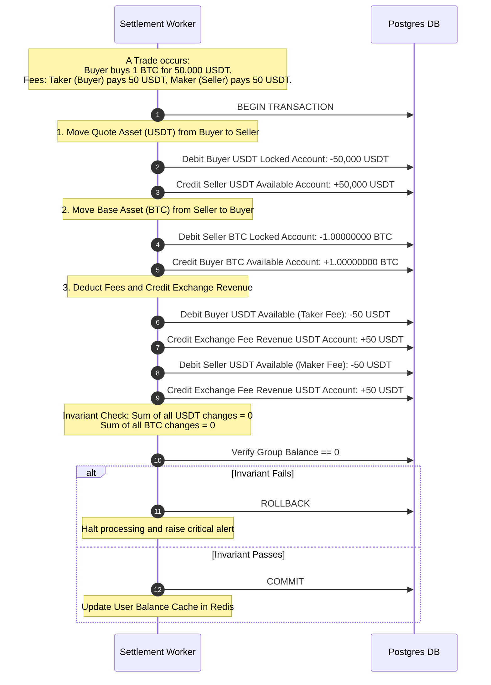
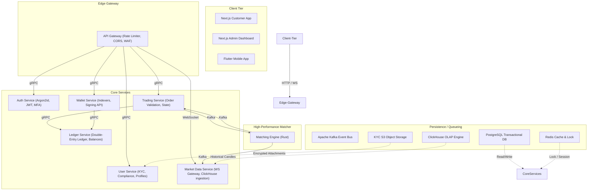

# System Flows and Mermaid Diagrams - Kryndex Exchange

This document maps out the core data and control flows of the Kryndex cryptocurrency exchange platform using Mermaid diagrams.

---

## 1. Authentication & Session Management Flow

This diagram demonstrates user login, token issuance, multi-factor authentication (MFA) validation, and session registration.

---

## 2. Deposit & Confirmation Scan Flow

This diagram shows how the Blockchain Indexer detects deposits, records pending balances, and updates the double-entry ledger upon confirmation.

---

## 3. Withdrawal Request & Approval Flow

This diagram maps out the user withdrawal process, compliance risk screening, admin multi-signature/four-eye approval, and network broadcast.

---

## 4. Order Lifecycle Flow

This diagram traces an order from user submission, balance locking in the ledger, execution in the matching engine, and settlement database recording.

---

## 5. Double-Entry Ledger Transaction & Settlement Flow

This diagram illustrates how transaction settlement operates on the immutable ledger. Inter-asset trades require balanced matching entries to maintain system invariants.

---

## 6. Service-Boundary & Message-Routing Architecture

This diagram shows the system boundaries and interaction patterns of Kryndex.

