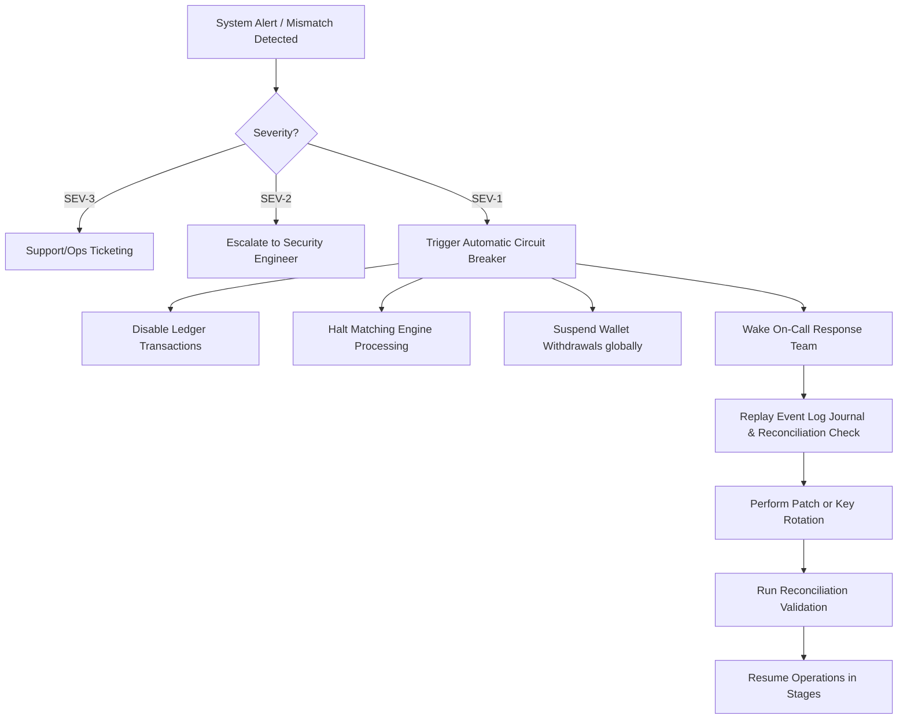

# Security Threat Model & Incident-Response Outline - Kryndex Exchange

This document details the threat modeling framework, assets, threat vectors, risk calculations, and the incident-response procedures for the Kryndex cryptocurrency exchange.

---

## 1. Asset & Boundary Identification

Kryndex identifies the following critical assets:
1. **User Credentials & Secrets**: Passwords (Argon2id), JWT refresh tokens, session cookies, and multi-factor authentication (TOTP) secrets.
2. **Personally Identifiable Information (PII)**: Legal names, dates of birth, scanned passports, and utility bills.
3. **Double-Entry Ledger Records**: The history of financial transactions and balance snapshots.
4. **Signing Private Keys**: Keys held by the wallet infrastructure used to broadcast withdrawal transactions.
5. **In-Memory Order Books**: Active limit orders in the Rust matching engine.
6. **API Credentials**: Developer key-secret pairs mapping user accounts to REST/WS endpoints.

---

## 2. Threat Analysis & Mitigations

We categorize threats using the STRIDE methodology (Spoofing, Tampering, Repudiation, Information Disclosure, Denial of Service, Elevation of Privilege) and score them based on Likelihood (1-5) and Impact (1-5) to calculate Risk (1-25).

| Threat Vector | Description | STRIDE Category | Likelihood (1-5) | Impact (1-5) | Risk Score | Mitigation Strategies |
| :--- | :--- | :--- | :--- | :--- | :--- | :--- |
| **Account Takeover (ATO) & Credential Stuffing** | Attackers use leaked lists of credentials to breach customer accounts. | Spoofing | 4 | 4 | **16 (High)** | • Enforce mandatory TOTP 2FA. • Progressive login delay and lockout on failed attempts. • Location/device fingerprint change alert and session revocation. • Anti-phishing code on user emails. |
| **Insider Abuse** | Staff members with administrative access perform unauthorized actions (e.g. stealing funds or falsifying KYC). | Elevation of Privilege | 2 | 5 | **10 (Medium)** | • Strict role-based access control (RBAC). • Mandatory dual-signature / "four-eye" approval for withdrawals and parameters changes. • Cryptographically signed, append-only administrative audit logs stored in OpenSearch with immutable properties. |
| **Hot-Wallet Compromise** | Attackers gain access to private keys stored in the wallet service. | Tampering | 1 | 5 | **5 (Low)** | • Keys are never stored in source code or database. • Integrate Hardware Security Modules (HSMs) or Multi-Party Computation (MPC) signing. • Limit hot wallet balance via automatic sweeps to offline cold wallets. • Velocity limits and withdrawal threshold limits block automated payouts. |
| **API-Key Theft** | Attackers steal API keys from developers to execute trades or withdraw assets. | Information Disclosure | 3 | 4 | **12 (High)** | • Disable withdrawal permission by default on API keys. • Require IP whitelist restrictions for trading keys. • Cryptographic signature verification (HMAC-SHA256) with request timestamp validation (5-second window) to block replay attacks. |
| **Database Compromise** | Direct database access by an attacker to alter balances or steal PII. | Tampering / Info Disclosure | 2 | 5 | **10 (Medium)** | • Encrypt PII at rest using AES-256-GCM (field-level encryption). • Double-entry ledger balance consistency checking before matching or withdrawals. • Restrict database connection privileges (read-only users, limited insert scopes). |
| **Order Manipulation & Front-Running** | Malicious users attempt to execute wash trades, paint the tape, or disrupt the matching engine. | Tampering | 3 | 3 | **9 (Medium)** | • Self-trade prevention (STP) implemented in matching engine core. • Enforce minimum notional limits and tick/step size filters. • Market abuse monitoring logs that flag suspicious trading activity patterns. |
| **Ledger Corruption & Double Settlement** | Software bug or malicious query attempts to credit balances multiple times. | Tampering | 1 | 5 | **5 (Low)** | • Database-level unique constraints on transaction UUIDs and blockchain TxHashes. • Enforce ledger invariant: `Total Debits = Total Credits` for every single journal entry transaction. • System immediately halts trading and deposits/withdrawals upon any reconciliation mismatch. |
| **Price-Feed Manipulation** | Ingestion of corrupted or manipulated external price index feeds. | Tampering | 2 | 4 | **8 (Medium)** | • Ingest from multiple separate liquidity sources and oracle endpoints. • Apply spread/deviation filters (e.g. reject variance > 5% in a single minute). |
| **DDoS Attacks** | Volumetric traffic to overwhelm API Gateway or WebSocket servers. | Denial of Service | 4 | 3 | **12 (High)** | • Cloudflare WAF integration. • Rate limiting on API Gateway (both global IP-based rate limiting and user-level rate limiting). • Geo-blocking of sanctioned or high-risk jurisdictions. |
| **Supply-Chain Attacks** | Malicious code injected into open-source npm or cargo dependencies. | Tampering | 2 | 5 | **10 (Medium)** | • Use exact dependency versions (no wildcards). • Automated dependency vulnerability scanners (e.g. Snyk, npm audit, Cargo audit) run on every build/PR pipeline. • Pin docker base images by hash rather than tags. |

---

## 3. Detailed Security Controls

### 3.1 Network & Infrastructure Security
- **Web Application Firewall (WAF)**: Cloudflare handles basic scraping, DDoS, and SQLi protection.
- **Mutual TLS (mTLS)**: Inter-service communication inside the Kubernetes cluster is secured and encrypted via mTLS using a service mesh (e.g., Istio).
- **Security Headers**: API gateway enforces strict security headers:
  - `Content-Security-Policy: default-src 'none'; frame-ancestors 'none';`
  - `X-Frame-Options: DENY`
  - `X-Content-Type-Options: nosniff`
  - `Strict-Transport-Security: max-age=63072000; includeSubDomains; preload`

### 3.2 Cryptographic Controls
- **Argon2id**: Passwords hashed with at least 16MB memory, parallelism of 4, and 3 iterations.
- **Signed Service Requests**: All internal requests carry a cryptographically signed header containing a service token, caller metadata, and time validity.
- **Field-Level Encryption**: Postgres encrypts customer data (name, email, documents) using AES-256-GCM. The key is managed using a secrets store (e.g., HashiCorp Vault).

---

## 4. Incident-Response Outline

Kryndex classifies security incidents into three levels:

### Severity Levels
1. **SEV-3 (Low)**: Minor system anomalies, single account brute force alerts, non-impactful log anomalies.
2. **SEV-2 (Medium)**: Suspected API-key leak, localized service failure, minor deposit processing delays.
3. **SEV-1 (Critical)**: Suspected hot wallet compromise, double settlement detection, ledger imbalance, database security breach, unauthorized admin action.

### Escalation Matrix & Isolation Procedures

### Remediation Playbooks
- **Ledger Imbalance Playbook**:
  1. Trigger DB system-wide lockdown (freeze all ledger accounts).
  2. Disconnect matching engine from trading service.
  3. Extract ledger transaction logs and run a replay validator to identify the mismatching record.
  4. Perform database correction via signed admin reversal transaction (4-eye approval required).
  5. Recalculate totals. Once balances reconcile, resume trading.
- **Hot-Wallet Key Compromise Playbook**:
  1. Rotate hot wallet signing address on-chain.
  2. Switch wallet indexer to scan new addresses.
  3. Transfer any remaining dust to offline cold wallet.
  4. Revoke compromised keys in Vault.
